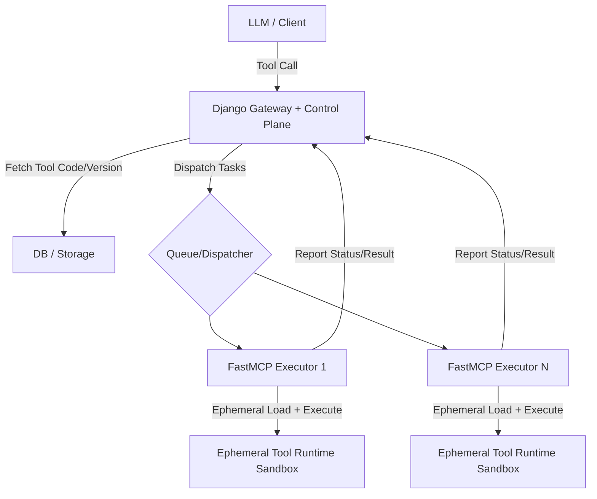

# ToolFlow

[中文](./README_CN.md) | English

---

### Overview

ToolFlow is a full-stack platform based on the **Ephemeral Execution Model** for dynamic routing and observability of LLM Tools. It includes:

- Django Gateway & Control Plane
- MCP Bridge (STDIO/SSE)
- Stateless FastMCP Executor & Runtime Configuration
- React Admin Frontend

### Architecture & Invocation Flow

#### 1. Architecture Flowchart



### Project Structure

- `server/`: Django gateway and management APIs
- `runtime/`: executor, bridge service, and runtime config
- `frontend/`: React + Vite frontend
- `start_services.py`: one-command local orchestrator

### Quick Start

1) Set up Python environment

```bash
python -m venv .venv
.venv\Scripts\activate
pip install -r requirements.txt
```

2) Install frontend dependencies

```bash
cd frontend
npm install
```

3) Initialize database

```bash
cd ../server
python manage.py migrate
python preset_tools.py
```

4) Return to project root and start all services

```bash
cd ..
python start_services.py
```

Default frontend URL: `http://127.0.0.1:5173`

### Environment Variables

Copy `.env.example` to `.env` and configure as needed:

- `DJANGO_SECRET_KEY`
- `DJANGO_DEBUG`
- `DJANGO_ALLOWED_HOSTS`
- `DJANGO_CORS_ALLOWED_ORIGINS`
- `OPENAI_BASE_URL`
- `OPENAI_API_KEY`
- `OPENAI_MODEL`

### Notes

- Runtime config file: `runtime/config.json`
- MCP Bridge script: `runtime/mcp_bridge.py`

