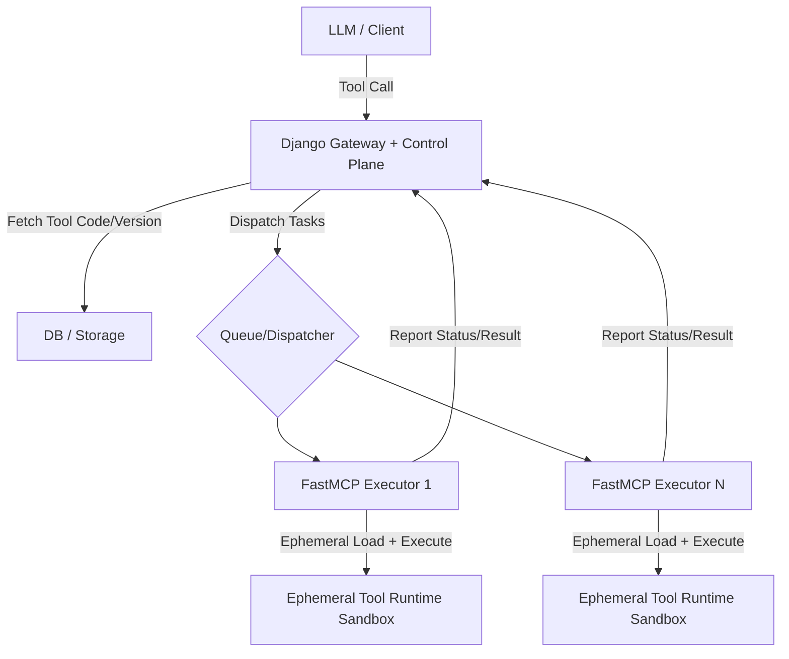

# ToolFlow

[中文](./README_CN.md) | English

---

**Stop building workflows. Write a function, ship a tool.**

ToolFlow is a runtime-first MCP tool system for LLM applications. You write plain Python functions — ToolFlow handles versioning, dispatch, isolation, and dynamic composition at runtime.

No DAGs. No pipelines. No restarts. Tools are loaded, executed, and destroyed on demand in isolated sandboxes. Compose them dynamically when called, not when deployed.

Built on Django (control plane) + FastMCP (stateless execution layer).

### Key Features

- 🐍 **Python-native tools** — write a function, register a tool. No boilerplate.
- ⚡ **Dynamic composition** — tools combine at runtime, not at design time.
- 🔒 **Ephemeral sandboxes** — every call runs in isolation; no shared state, no side effects.
- 🧱 **Control plane / execution plane separation** — Django manages assets; FastMCP executes statelessly.
- 🔄 **Built-in lifecycle management** — version, release, and monitor tools independently.

### Architecture & Invocation Flow

#### 1. Architecture Flowchart



### Project Structure

- `server/`: Django gateway and management APIs
- `runtime/`: executor, bridge service, and runtime config
- `frontend/`: React + Vite frontend
- `start_services.py`: one-command local orchestrator

### Quick Start

1) Set up Python environment

```bash
python -m venv .venv
.venv\Scripts\activate
pip install -r requirements.txt
```

2) Install frontend dependencies

```bash
cd frontend
npm install
```

3) Initialize database

```bash
cd ../server
python manage.py migrate
python preset_tools.py
```

4) Return to project root and start all services

```bash
cd ..
python start_services.py
```

Default frontend URL: `http://127.0.0.1:5173`

### Environment Variables

Copy `.env.example` to `.env` and configure as needed:

- `DJANGO_SECRET_KEY`
- `DJANGO_DEBUG`
- `DJANGO_ALLOWED_HOSTS`
- `DJANGO_CORS_ALLOWED_ORIGINS`
- `OPENAI_BASE_URL`
- `OPENAI_API_KEY`
- `OPENAI_MODEL`

### Notes

- Runtime config file: `runtime/config.json`
- MCP Bridge script: `runtime/mcp_bridge.py`

