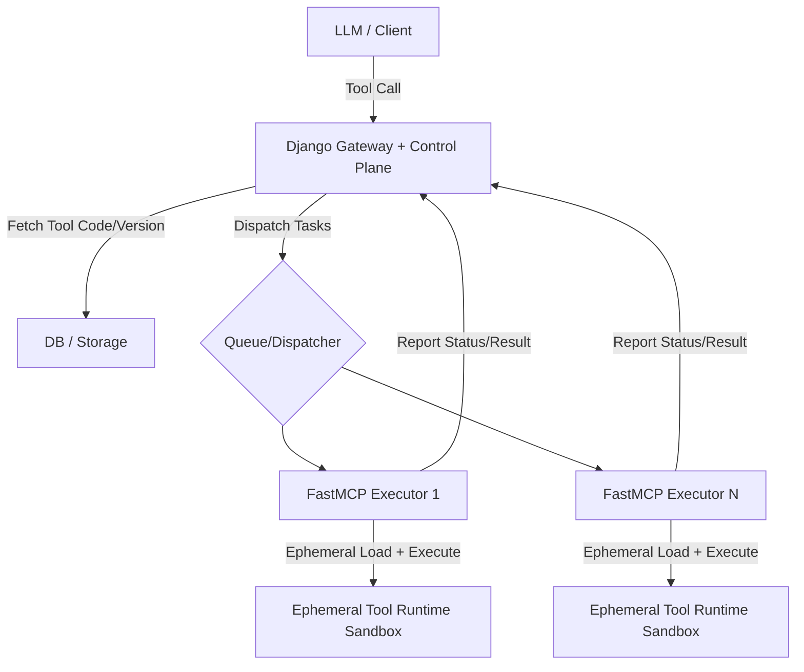

# ToolFlow

中文 | [English](./README.md)

---

**别再写 workflow 了。写个 Python 函数，那就是你的工具。**

ToolFlow 是一个面向 LLM 应用的运行时优先 MCP 工具系统。不需要搭 DAG，不需要定义静态 pipeline，只需写普通的 Python 函数 —— 工具的调度、版本管理、隔离执行，全部由 ToolFlow 在运行时搞定。

没有编排 DSL，无需每次改动都重新部署。工具在运行时动态组合，在沙箱中隔离执行，每次调用无状态、干净清爽。

### 为什么选 ToolFlow？

- **无需工作流** —— 工具在运行时动态组合，而非提前写死
- **Python 原生** —— 任意 Python 函数即可成为工具，零样板代码
- **无状态 & 隔离执行** —— 每次执行在独立沙箱中运行，失败不影响其他调用
- **控制面与执行面分离** —— Django 负责管理控制逻辑，FastMCP 专注无状态执行
- **内置生命周期管理** —— 工具版本化、发布与状态监控，无需重启服务

### 系统架构流转

#### 1. 架构示意图



### 目录结构

- `server/`：Django 网关与后台管理 API
- `runtime/`：执行器、桥接服务与运行配置
- `frontend/`：React + Vite 前端
- `start_services.py`：本地一键启动脚本

### 快速启动

1) 配置 Python 环境

```bash
python -m venv .venv
.venv\Scripts\activate
pip install -r requirements.txt
```

2) 安装前端依赖

```bash
cd frontend
npm install
```

3) 初始化数据库

```bash
cd ..\server
python manage.py migrate
python preset_tools.py
```

4) 返回项目根目录并启动全部服务

```bash
cd ..
python start_services.py
```

前端默认地址：`http://127.0.0.1:5173`

### 环境变量

请将根目录 `.env.example` 复制为 `.env`，并按需配置：

- `DJANGO_SECRET_KEY`
- `DJANGO_DEBUG`
- `DJANGO_ALLOWED_HOSTS`
- `DJANGO_CORS_ALLOWED_ORIGINS`
- `OPENAI_BASE_URL`
- `OPENAI_API_KEY`
- `OPENAI_MODEL`

### 说明

- 运行时配置文件位于 `runtime/config.json`
- MCP Bridge 脚本位于 `runtime/mcp_bridge.py`

